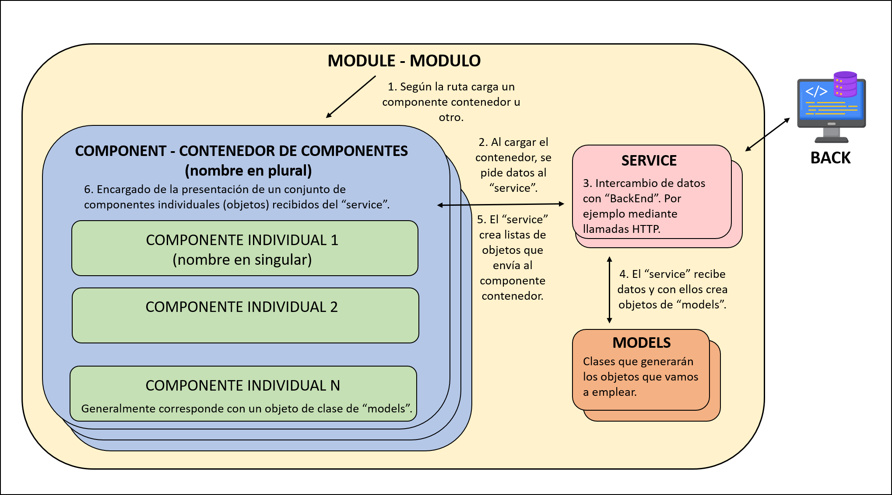

# AngularBasics

## 1.Instalación

Para usar Angular debe estar instalado NODE y NPM.

Comprobar instalacion de NODE y NPM:

`node -v`

`npm -v`

En caso de no estar instalado:

NODE

https://nodejs.org/es/download

NPM

`npm install npm@latest -g`

Comprobar instalación de typescript:

`tsc -v`

En caso de no estar instalado:

`npm install -g typescript`

Si da problemas:

`npm cache verify`

`npm cache clean`

Instalar Angular:

`npm install -g @angular/cli`

## 2.Crear un proyecto

`ng new <nombreApp>`

`ng serve -o`

Se abrirá un proyecto Angular por defecto en puerto 4200.

### Instalar Bootstrap, jquery y popper

`npm install bootstrap jquery @popperjs/core`

En el archivo angular.json:

```
"styles": [
  "node_modules/bootstrap/dist/css/bootstrap.min.css",
  "src/styles.scss"
],
"scripts": [
  "node_modules/jquery/dist/jquery.min.js",
  "node_modules/@popperjs/core/dist/umd/popper.min.js",
  "node_modules/bootstrap/dist/js/bootstrap.min.js"
]
```
## 3.Estructura de modulos y componentes


### 3.a. Modulos

Un módulo es un conjunto de código con una funcionalidad determinada:



Creamos un módulo:

`ng g m <nombre_modulo> --routing true`

### 3.b. Componentes

Un componente es un elemento reutilizable. Puede ser desde un elemento HTML como un "button" hasta una lista (ul o li), un "header" o un conjunto de etiquetas o elementos "div" con una funcionalidad en particular.

Un componente en Angular es un elemento que está compuesto por:

- Un archivo que será nuestro Template (app.component.html), el cual es nuestro HTML, que es el que se va a visualizar en la interfaz de usuario, la vista o en términos más simples lo que vas a ver en la página. 

- Un archivo de lógica, la cual es la que pondremos en un archivo .ts (como por ejemplo app.component.ts), ese archivo debe incluir una clase y esta es la que va a contener las propiedades que se van a usar en la vista (HTML) y los métodos que será las acciones que se ejecutarán en la vista. En este archivo de lógica también se incluye una metadata, que es definida con un decorador,  que identifica a Angular como un componente.

- Un archivo para el CSS (podemos usar un preprocesador como SASS o LESS), donde incluiremos los estilos, lo que nos ayuda a hacer bonita nuestra aplicación.


Creamos un contendor de elementos iguales. Le pondremos el nombre en plural:

`ng g c <nombre_modulo>/<nombre_componente_plural>`

Creamos un componente singular:

`ng g c <nombre_modulo>/<nombre_componente_plural><nombre_componente_singular>`


### 3.c. Clases

Un modelo en angular es una clase que representa un objeto con propiedades que permite la utilización de la misma desde clases externas, evitando la reiteración de código.

Creamos una clase:

1. Creamos una carpeta "models" en el módulo.
2. Creamos un fichero `<nombre_fichero>.ts`
3. Creamos la clase en su interior:
```
export class NombreClase{
  constructor(
  public propiedad : tipo;
  public propiedad: tipo;
  ){}
}
```

Cuando usemos un objeto en alguno de nuestros componentes, podemos leer/actualizar sus atributos mediante [NgModel](https://angular.io/api/forms/NgModel).

## 4. Servicios

Un servicio es un proveedor de datos, que mantiene lógica de acceso a ellos y operativa relacionada con el negocio y las cosas que se hacen con los datos dentro de una aplicación. Los servicios serán consumidos por los componentes, que delegarán en ellos la responsabilidad de acceder a la información y la realización de operaciones con los datos.

Creamos un servicio:
`ng g s service/<nombre_sevicio>`

En el modulo:
```
@NgModule({
  imports: [
    CommonModule
  ],
  declarations: [<nombre_componente_contenedor>],
  providers: [<nombre_servicio>]
})
```
Lo importamos en el componente contenedor donde lo queremos usar:
```
import { <nombre_servicio> } from '<ruta_servicio';
```
Inyectamos la dependencia a través del constructor:
```
constructor(public nombreServicio: <nombre_servicio>) { }
```

En este momento ya podemos emplear los métodos del "service" en nuestro componente.

En general, los servicios que consumen una API REST, se tratarán de una serie de métodos de llamadas HTTP ([HTTPClient](https://angular.io/guide/http)) .


